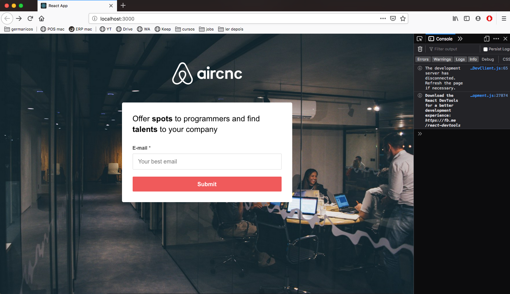
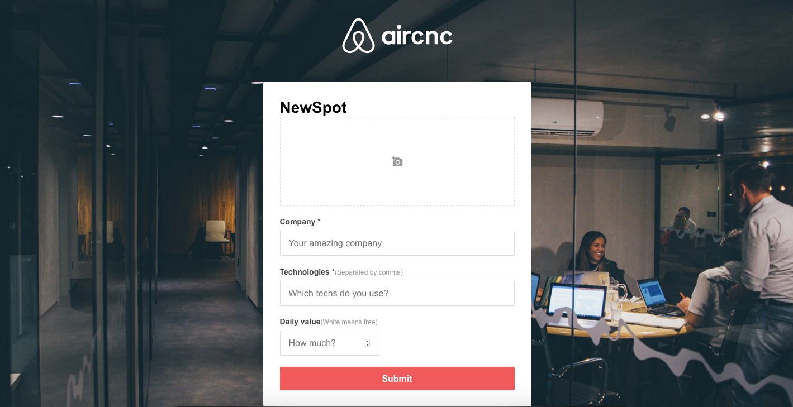
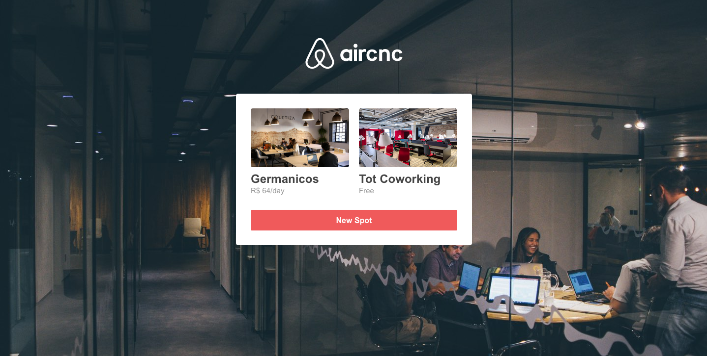
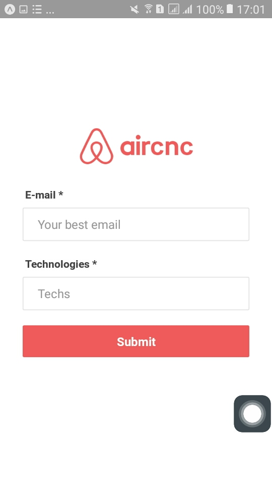
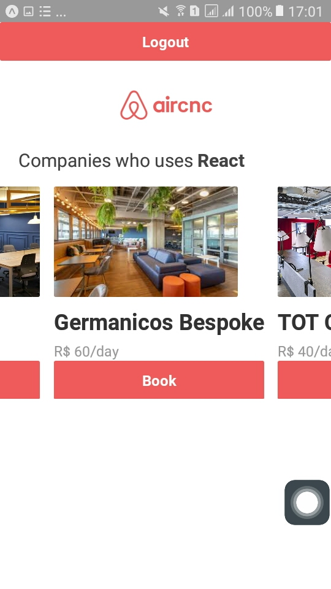
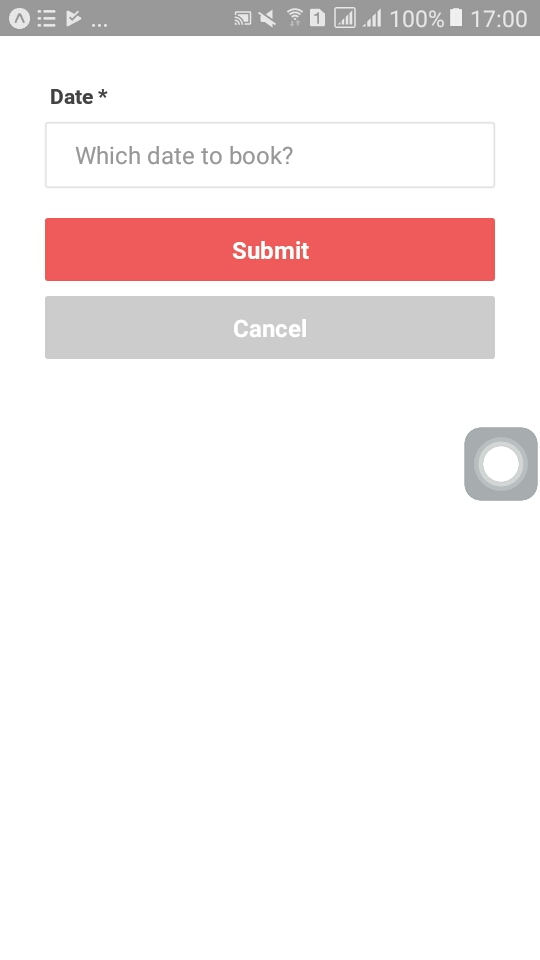

# AirRCnC Air - code and coffee

Is an fullStack application developed during oministack 9 promoted by RocketSeat.

Based on AirBnB, but with AirCnC, developers can search and book a place to work such a coworker and the companies can rent their spaces and even meet some good employees.

## ScreenShots

## Front end

## Mobile

