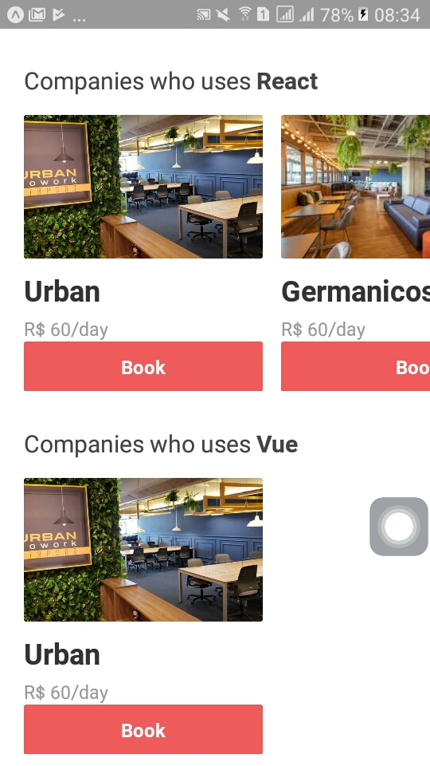

# AirRCnC Air - code and coffee

Is an fullStack application developed during oministack 9 promoted by RocketSeat.

Based on AirBnB, but with AirCnC, developers can search and book a place to work such a coworker and the companies can rent their spaces and even meet some good employees.

# Front end

This interface is the companies' interface. If a company wants to subscribe a spot to rent, the must use the webVersion of AirCnC.

# Mobile

Programmes who wants to work in a registered place, must install the mobile version and seek for a company that works with the chosen languages

# Real time

One important feature that are implemented is the REAL TIME COMMUNICATION. If a programmer make a book, if the owner of the spot are logged, he will be notified at dashboard screen. When the owner respond, the programmer will be notified at his homepage. All this without refresh the app.

## ScreenShots

## Front end

## Mobile

## Features:

- react + react native + node (fullStack)
- using express
- using mongoDB
- sockets to real time communication
- Upload of images
- react hook
    - setState and useEffect and useMemo

## TODO:

- Use a database to store connected users like radiusDB
- Handle user's inputs (handle bad inputs)